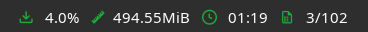

# polybar_yt-dlp

## Description

This is a bash script to display yt-dlp download progress in Polybar.

It's great when you want to work on other activities while your download is in the background on another workspace. Giving you the option to keep track of the download progress in polybar.

## Eye Candy




##  Dependencies

* `bash`

* `xprop`

* `polybar`

* `xdotool`

* `yt-dlp`

##  Setup

* Install the dependencies above.

* Save the script somewhere in `~/.config/polybar/`.

* Don't forget to make the script executable: `chmod +x ~/.config/polybar/yt-downloads.sh`.

* Copy the module settings into your polybar configuration file.

##  Customization

* Add your favorite terminal in the script example: "Replace 'kitty' with your Terminal of choice"
`proc="kitty"`

* I have provided 3 scripts, 1 with color customization, 1 without and 1 with Nerd Font Icons.

* `yt-downloads-nocolor.sh` with no color customizationts to allow the use of fonts, Etc from your polybar configuration file.

* `yt-downloads.sh` has multiple values of color customizations.
* Customizing the script is pretty straight forward, I have provided some colors within the script along with examples, Change the colors to your choice.

* `yt-downloads-icons.sh` has multiple values of color customizations and Icons.
* Customizing the script is pretty straight forward, I have provided some colors within the script along with examples, Change the font icons and colors to your choice.

##  Example Module

### Polybar Module
```ini
[module/yt-downloads]
type = custom/script
exec = ~/.config/polybar/scripts/yt-downloads.sh 2>/dev/null
interval = 1
label = %output%
format-foreground = ${colors.foreground}
format-background = ${colors.background}
format-prefix-foreground = ${colors.foreground}
```
